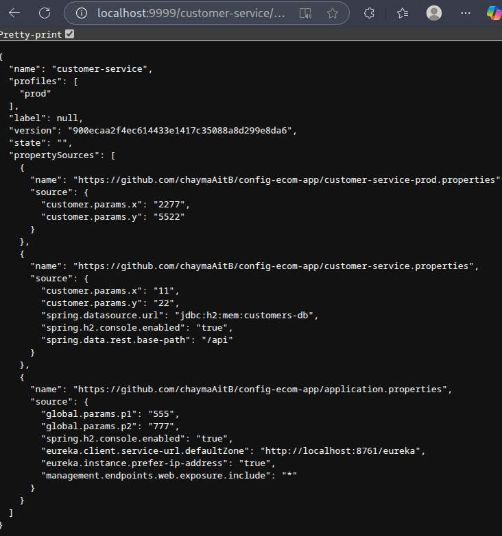

# Microservices Architecture Overview

This project demonstrates a microservices architecture built with Spring Cloud, structured into four main components:

### 1. Architecture with Spring Cloud Microservices
Implementation of core microservices such as **Customer Service** and **Inventory Service**, establishing the base for distributed services.

### 2. Routing Service (Gateway)
A **Spring Cloud Gateway** service that manages dynamic routing and API gateway responsibilities for client requests.

### 3. Service Discovery with Eureka
Integration of **Eureka Discovery Service** enables automatic registration and discovery of microservices, facilitating dynamic routing and load balancing.

### 4. Configuration Service
A centralized **Spring Cloud Config** manages externalized configuration for all microservices, supporting multiple environments and enabling **dynamic refresh** without service restarts.

This modular design ensures scalability, maintainability, and ease of configuration management across diverse environments.

# Testing the Application

